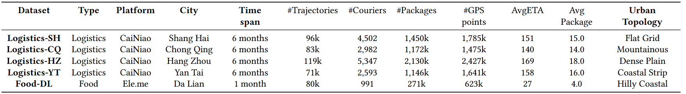
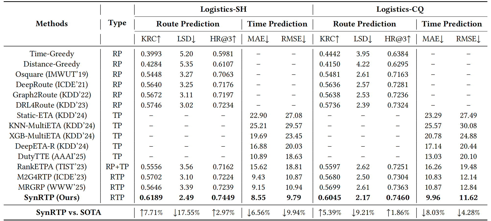
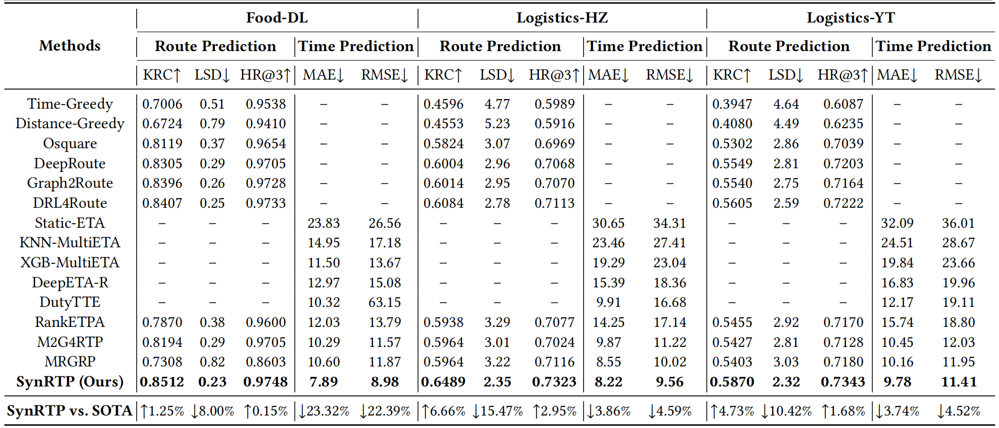
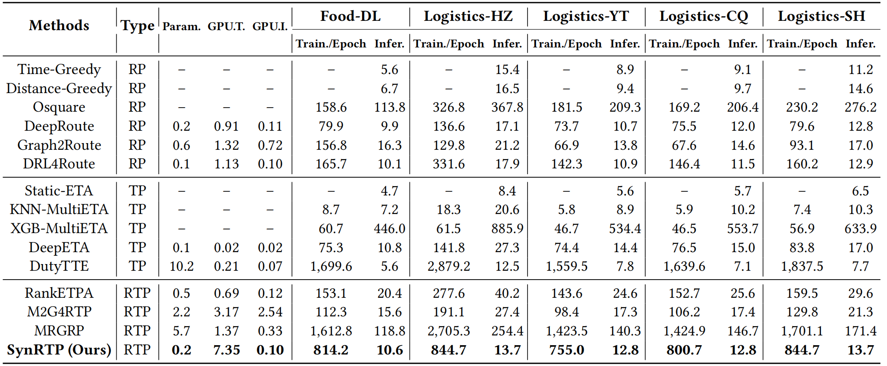
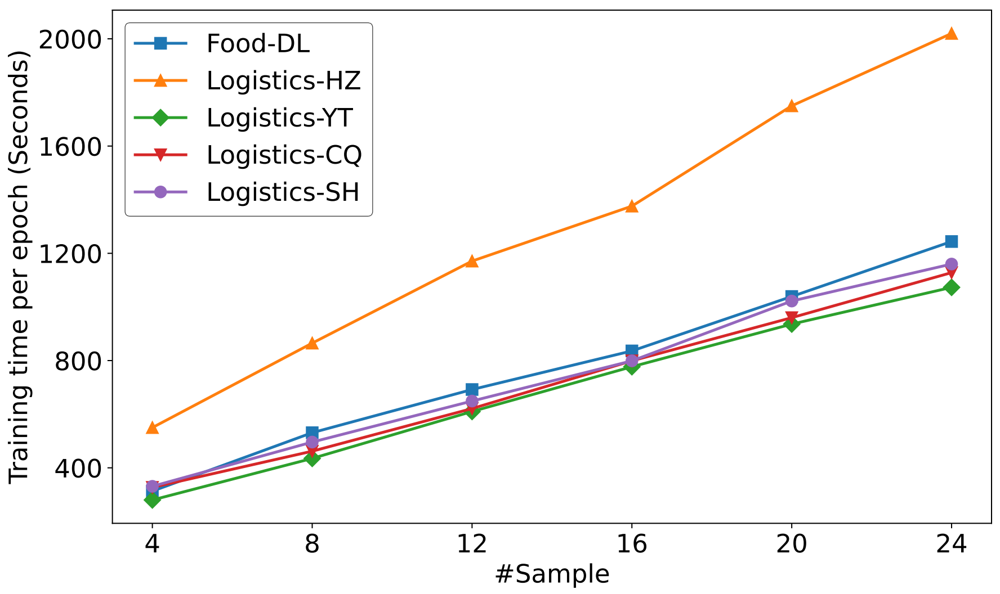

# SynRTP

## Reproducibility & Source Code
To ensure full reproducibility and facilitate future research, we have released the complete source code for **SynRTP** in this anonymous repository.
* **SynRTP Implementation:** Pre-training, GDRPO fine-tuning, and Synergistic Inference, see '/algorithm/'.
* **Baseline Reproduction:** All baselines code are released in '/baselines/'. The performance comparisons reported in our paper are strictly fair and reproducible.

---

## 1. Dataset Diversity & Generalization (Rebuttal Q1)

> Q1. Dataset diversity & generalization (R2-W1/W4/SI4, R3-W1/SI1, R4-W1).
>- Dataset. We add three datasets (strictly anonymized via hashed IDs and offset coordinates): Logistics-HZ/YT (distinct city topologies, Cainiao logistics) and Food-DL (food delivery, Ele.me platform). We also searched for international last-mile datasets, but public corpora currently lack the necessary task/trajectory fields. We will explicitly discuss this limitation and future plans.
>- Generalization. Across all five datasets, Logistics-SH/CQ/HZ/YT, Food-DL (renamed "TaskType–City"), SynRTP consistently outperforms the strongest RP/TP/RTP baselines: KRC improvements of 1.25–7.71% and LSD reductions of 8.00–17.55%, while MAE/RMSE decrease by up to 23.32%/22.39%. 

### 1.1 Extended Dataset
We have expanded the evaluation to 'five' distinct datasets to verify robustness. Three new datasets are added: **Logistics-HZ** (Hangzhou), **Logistics-YT** (Yantai), and [**Food-DL**](https://tianchi.aliyun.com/competition/entrance/231777/information) (Ele.me Food Delivery). We provide detailed statistics in **Table 1**.

<p align="center"> <b>Table&nbsp;1</b> Summary statistics of the datasets. AvgETA (in minutes) stands for the average arrival time per package. AvgPackage means the average package number of a courier per day. </p>



#### A. Privacy Statement
All datasets are strictly anonymized. User IDs and order IDs are hashed, and GPS coordinates are offset to prevent re-identification while preserving topological properties.

#### B. Data Diversity

As shown in **Table 1**, these datasets cover a wide spectrum of city scales and urban environments.

**i) City Scale Diversity.**
To ensure the model generalizes across different administrative scales and population densities, we selected cities ranging from massive megacities to major regional hubs:
* **Mega-Cities (>20 Million):** Shanghai (SH) and Chongqing (CQ) represent the highest tier of urban density and complexity, with populations exceeding 20 million and 30 million, respectively.
* **Large Metropolitan Area (10~20 Million):** Hangzhou (HZ) represents a rapidly growing new-tier mega-city with a population exceeding 10 million.
* **Major Regional Cities (5~10 Million):** Yantai (YT) and Dalian (DL) represent major regional economic centers with populations exceeding 5 million, testing the model's adaptability to medium-to-large scale urban networks.

**ii) Urban Topology Diversity.**
These cities exhibit drastically different road network structures and geographical constraints:
* **Financial/Multi-center:** As a global financial hub located on a flat alluvial plain, **Shanghai** features a dense, grid-like road network with multiple active commercial centers. The routing challenge here lies in managing extreme traffic density and complex high-rise delivery scenarios.
* **Mountainous/Distributed:** Known as a "Mountain City", **Chongqing** possesses a unique non-planar road network characterized by steep gradients, numerous bridges, and tunnels. The topology is highly distributed rather than centralized, requiring the model to understand complex vertical spatial dependencies.
* **E-commerce/Multi-center:** As China's e-commerce headquarters, **Hangzhou** features a unique mix of commercial hubs and scenic preservation areas. Its traffic patterns are heavily influenced by logistics parks and high-frequency dispatching demands specific to online retail.
* **Port/Coastal-belt:** Unlike inland grid cities, **Yantai & Dalian** often feature linear urban layouts constrained by the coastline. Both cities share a distinct "Port/Coastal" topology. This feature results in specific routing challenges, testing the model's ability to handle physical boundary constraints.


#### C. International Data Limitations
We conducted an exhaustive search for international last-mile datasets. However, existing public corpora (e.g., from Amazon or grab) currently lack the necessary **sequential trajectory fields** or **task-level timestamps** required for joint Route-Time Prediction (RTP). While we focus on high-quality industrial datasets from China, the structural diversity (Mountain vs. Plain, Logistics vs. Food) effectively simulates diverse global delivery scenarios.


### 1.2 Comprehensive Results Analysis

We present the full performance comparison across all five datasets in 'Table 2'. 

<p align="center"> <b>Table&nbsp;2</b> Performance comparison on route and time prediction. An upward arrow ($\uparrow$) indicates that higher values are better, while a downward arrow ($\downarrow$) indicates that lower values are better. “--” denotes unavailable results. For SynRTP, we report the mean over three runs, with $\pm\mathrm{std}\le 0.003$ for KRC/HR@3, $\pm\mathrm{std}\le 0.02$ for LSD, and $\pm\mathrm{std}\le 0.26$ for MAE/RMSE. </p>





The results demonstrate consistent generalization:
* **Consistent Improvements:** SynRTP consistently outperforms the strongest baselines (including *MRGRP* and *M2G4RTP*) across all datasets. Specifically, we observe **KRC improvements of 1.25%–7.71%**, **LSD reductions of 8.00%–17.55%**.
* **Cross-Domain Generalization (Food-DL):** The **Food-DL** dataset (Ele.me) represents a completely different business logic—point-to-point "On-Demand" delivery with strict time windows, unlike the planned routes in logistics.
    * *Result:* SynRTP achieves a **1.25% KRC gain** and a massive **23.32% MAE reduction** on Food-DL.
    * *Insight:* This proves that SynRTP's synergy mechanism is not overfitting to logistics patterns. The continuous time supervision successfully helps the policy navigate the highly dynamic food delivery graph, confirming the hypothesis that "better time awareness leads to better routing."


---

## 2. Computational Efficiency & Deployment (Rebuttal Q2)

>Q2. Computational efficiency and stability (R1-W2, R2-W5, R3-W3, R4-W2/W3).
>- Efficiency comparison. SynRTP uses only 0.2M parameters, 0.1GB GPU memory at inference, and achieves the fastest inference time (10.6–13.7s on the full test set) among RTP models, while MRGRP and M2G4RTP require up to 5.7M/2.2M parameters and significantly higher latency (15.6-254.4s).
>- Sampling-cost. Training-Time/Epoch scales approximately linearly with #sample and remains manageable at #sample=16, which we select as a good accuracy–efficiency tradeoff. RL fine-tuning is performed offline; online serving uses a single greedy decode, so latency is compatible with large web-scale logistics.
>- Stability. Repeated runs show negligible variance (std≤0.02 for KRC/HR@3/LSD), confirming SynRTP's stability.

<p align="center"> <b>Table&nbsp;2</b> Efficiency comparison across different datasets. All experiments use a fixed batch size of 64, and each model employs an identical configuration across datasets to ensure consistent parameter counts and GPU memory usage. Metrics reported include: number of parameters (Param., in millions), GPU memory consumption during training and inference (GPU.T. and GPU.I, in GB), training time per epoch (Train./Epoch, in seconds), and inference time on the full test set (Infer., in seconds). "--" indicates that the value is not available. Among the evaluated RTP methods, SynRTP achieves the best performance in terms of parameter scale, GPU memory usage during inference, and inference speed. </p>



### 2.1 Inference Efficiency & Deployment Costs
SynRTP is designed for **low-cost, high-frequency deployment**.
* **Model Lightweightness:** As shown in **Table 3**, SynRTP utilizes only **0.2M parameters** (Actor-only inference), which is **10x–20x smaller** than graph-heavy baselines like *M2G4RTP* (2.2M) and *MRGRP* (5.7M).
* **Hardware Requirements:** During inference, SynRTP consumes only **0.1GB of GPU memory**. This extreme efficiency means the model does not require high-end A100/V100 clusters; it can be easily deployed on **consumer-grade GPUs (e.g., RTX 30/40 series)** or even **CPU-only inference servers** with minimal latency penalty, significantly lowering the deployment cost for logistics platforms.
* **Speed:** On the full test set, SynRTP achieves the fastest inference (10.6–13.7s total), fully satisfying real-time dispatching requirements.


### 2.2 Sampling Cost & Offline/Online Separation
We address the concern regarding the sampling number (`#sample`) used in GDRPO.
* **Offline RL Training:** The multi-route sampling ('\#sample=16') is strictly an **offline training strategy**. During this phase, the computational cost scales linearly with `#sample`, as shown in **Figure 1**. We selected `#sample=16` as the optimal convergence-efficiency tradeoff.
* **Online Serving:** Once the model is deployed, the policy $\pi_\theta$ is frozen. We use **Greedy Decoding** (or single-path sampling) for inference. No group sampling or advantage calculation is performed online. Thus, the heavy RL computation does not impact the online system latency.




<p align="center"><b>Figure&nbsp;1</b> Computational overhead analysis on different datasets with varying sampling numbers $\#sample$. The training time per epoch (in seconds) exhibits a linear relationship with the increase of $\#sample$. While larger $\#sample$ values introduce more computation, the overhead remains within a manageable range across all datasets, justifying the choice of $\#sample=16$ for balancing efficiency and performance. </p>


## 3. Methodological Novelty: GDRPO vs. RL Baselines (Rebuttal Q3)

>Q3. Novelty of GDRPO vs. PPO/Sequence RL (R1-W1, R2-W3/SI1)
>- GDRPO is a specialized adaptation of PPO/GRPO for routing, addressing the "granularity mismatch" between step-level updates and sequence-level metrics. We will add a formal comparison table (vs. PPO/GRPO/GSPO/ReST) to highlight:
>- Critic-Free (vs. PPO): GDRPO has no unstable and expensive Value Network (Critic).
>- Stable Anchor (vs. GRPO/GSPO/ReST): Unlike Group Relative methods that use a noisy group mean as the baseline, GDRPO uses a deterministic greedy baseline ($\pi^*$) as a stable performance anchor. This design yields a low-variance Location-Deviation Advantage (Eq.17) that explicitly rewards beating the model's best deterministic strategy on the non-differentiable LSD metric.
>- Integration: It is tightly coupled with the uncertainty-based multi-task loss (Eq.21) to balance exploration with imitation.


To clarify the novelty of **GDRPO**, we provide a multi-dimensional comparison against standard **PPO**, **GRPO**, and advanced sequence methods like **GSPO** [1] and **ReST-RL** [2].

**Table: Comparison of RL Optimization Algorithms in Routing**

| Feature Dimension | **PPO** | **GRPO** | **GSPO** [1] | **ReST-RL** [2] | **GDRPO (Ours)** |
| :--- | :--- | :--- | :--- | :--- | :--- |
| **Reward Granularity** | Token/Step-level | Token/Step-level | Sequence-level | Sequence-level | **Sequence-level (LSD)** |
| **Critic / Value Net** | **Required** (High Cost) | None | None | Optional / Value Model | **None** (Critic-free) |
| **Baseline Mechanism** | Learned $V_\phi(s)$ | Group Mean $\mathbb{E}[\pi^{(g)}]$ | Group Mean $\mathbb{E}[\pi^{(g)}]$ | Filtered History | **Greedy Anchor $\pi^*$** |
| **Advantage Estimation** | GAE (Step-wise) | Relative to Mean | Relative to Mean | Filtering / Scoring | **Location-Deviation** (Eq.17) |
| **Optimization Stability** | Low (Sensitive to Critic) | Moderate (Noisy Mean) | High | High | **Very High** (Deterministic) |
| **Best Use Case** | Continuous Control | LLM Reasoning | LLM Generation | Iterative Alignment | **Routing / Global Metrics** |

**Highlights of GDRPO:**
1.  **Granularity Mismatch Solution:** Unlike PPO/GRPO which apply step-level updates, GDRPO uses **Sequence-Level Advantage** to directly optimize the non-differentiable, holistic LSD metric.
2.  **Stable Anchor:** Unlike GRPO/GSPO which use a stochastic "Group Mean" as the baseline, GDRPO uses a **Deterministic Greedy Rollout ($\pi^*$)**. This serves as a stable performance anchor, reducing variance by asking: *"Did exploration beat the model's current best strategy?"*
3.  **Efficiency:** Being Critic-free, it avoids the massive overhead of training a Value Network for complex graph states.

---

## 4. Synergy Mechanism Theory (Rebuttal Q4)

>Q4. Synergy mechanism & gradient paths (R1-W3, R2-W4/SI5).
>- The synergy stems from the Route-Aware Context (Eq.14), which aggregates probability-weighted embeddings. The gradient path is: $\nabla \mathcal{L}_{Time} \to \text{Context} \to \text{Route Logits} (\pi_\theta)$. This path provides a dense, differentiable signal that shapes the policy to favor nodes enabling accurate time predictions, effectively using TP as an implicit reward.


We illustrate the gradient flow that enables the "Time Prediction" (TP) task to act as an implicit reward for the "Route Prediction" (RP) task.

* **Route-Aware Context:** 
  
$$s_i = \sum_{j \in \mathcal{V}} \pi_\theta(j|\hat{\pi}_{<i}) \cdot \tilde{q}_j$$

* **Synergy Gradient Flow:**

$$\frac{\partial \mathcal{L}_{Time}}{\partial \theta} = \frac{\partial \mathcal{L}_{Time}}{\partial \hat{\delta}_i} \cdot \underbrace{\frac{\partial \hat{\delta}_i}{\partial s_i} \cdot \sum_{j} \tilde{q}_j}_{\text{Context Awareness}} \cdot \frac{\partial \pi_\theta(j|\dots)}{\partial \theta}$$

* **Mechanism:** 
By backpropagating $\mathcal{L}_{Time}$ through the probability-weighted context $s_i$, the model is forced to increase the probability of next-hop nodes that are spatially and temporally coherent. This acts as a **dense, differentiable reward** shaping mechanism, complementing the sparse RL signal.


---

## 5. Fairness, Related Work & Ethics (Rebuttal Q5)

>Q5. Fairness, related-work & ethics (R2-W2/W6/SI2; R3-W2; R4-W2).
>- Fairness. DutyTTE/MRGRP use official implementations with careful hyperparameter search; the other baselines follow the best configurations released with LaDe. All models are trained with the same input features, early stopping strategy, and evaluation metrics. Our Graphormer encoder uses only the same input features, without additional information. 
>- Related-work. We will expand the discussion to cover additional RTP models.
>- Ethics. We will add a short ethics paragraph: SynRTP is currently used solely to predict couriers' future routes and arrival times to improve ETA reliability and dispatching, not to constrain individual workers' choices.

### 5.1 Expanded Related Work & Challenges
We discuss the landscape of Joint Route-Time Prediction (RTP) and position our work against recent advances:
* **Advantages of Joint RTP:** Joint modeling allows shared representations of spatiotemporal graphs, theoretically benefiting both tasks.
* **Existing Gaps:**
    * *RankETPA* and *DeepRoute+* treat tasks sequentially but often suffer from error propagation.
    * *M2G4RTP* and *MRGRP* introduce advanced graph encoders but still treat RP and TP as loosely coupled heads, leading to the **"Uncooperative Problem"** (gradient isolation).
    * **New Discussion ($I^2RTP$):** We acknowledge the relevant work **$I^2RTP$** ("*Modeling Intra- and Inter-community Information...*"), which leverages community detection for delivery prediction. While $I^2RTP$ improves representation via community structures, it still relies on conventional multi-task learning objectives. In contrast, **SynRTP** is the first to fundamentally alter the **optimization paradigm** via synergistic decoding and sequence-level RL, directly addressing the negative transfer issue.


### 5.2 Baseline Fairness
To ensure fair comparison, all baselines (including *DutyTTE*, *MRGRP*) were re-trained using:
1.  **Identical Features:** All models consume the same raw inputs (coordinates, timestamps) and our Graphormer encoder (unless the baseline has a specialized encoder).
2.  **Identical Evaluation:** Same train/val/test splits and metric calculations.
3.  **Open Source:** As mentioned in Section 1, these re-implementations are released to guarantee transparency.

### 5.3 Ethical Considerations
* **Assistance vs. Control:** SynRTP is designed to **predict** natural courier behavior to improve system estimates (ETA), not to **prescribe** or enforce routes. It serves as an auxiliary tool to reduce dispatcher uncertainty.
* **Cognitive Load:** By predicting routes that align with human preferences (e.g., avoiding difficult U-turns), the system can assign tasks that reduce physical and cognitive fatigue for couriers.
* **Privacy:** All courier IDs are hashed, and GPS coordinates are transformed relative to the region center, ensuring no individual can be tracked or identified.

---


## 6. Experimental Details
---
### 6.1 Implementation Details & Fairness Protocol

To ensure reproducibility and rigorous fair comparison, all experiments were conducted on a uniform hardware platform equipped with a single Tesla V100 (16 GB) GPU. We implemented SynRTP using PyTorch. For all baseline models, we adopted a standardized evaluation protocol to eliminate implementation bias:

<b>(1) Standardized Benchmark Configurations</b>
<b> LaDe Benchmark Baselines: </b> Most baselines (including DeepRoute, Graph2Route, L2R, etc.) and the datasets used in this paper are sourced from the open-source LaDe Benchmark repository. To ensure our results are directly comparable with community standards, we strictly utilized the official implementations and default optimal hyperparameter configurations provided by the LaDe repository. <b>Independent Baselines: </b>For baselines not included in LaDe (i.e., DutyTTE and MRGRP), we strictly adhered to the same principle: utilizing their respective official open-source codes and adopting the default optimal hyperparameter combinations recommended by the original authors. This strategy ensures that every baseline is evaluated at its intended peak performance capability, avoiding any potential bias from subjective hyperparameter tuning.

<b>(2) Strict Fairness Control </b> 
Beyond model configurations, we enforced a unified training protocol across all methods to ensure no model received an unfair advantage: <b> Input Consistency.</b>  All models utilize the exact same set of input features (spatial coordinates, temporal timestamps, and courier profiles). We ensured that no baseline was handicapped by missing features, nor did any model benefit from extra information unavailable to others. <b> Termination Criterion.</b> To prevent over-training or under-training biases, we applied a consistent Early Stopping mechanism across all models. Training terminates if the validation metric (KRC) does not improve for a patience of 11 epochs.

<b>(3) SynRTP Settings:</b> 
For our proposed SynRTP, we selected hyperparameters based on validation set performance: a hidden dimension $d_h=32$, a 3-layer Graphormer encoder with 4 attention heads, and a GDRPO group sampling size $G=16$. The model is trained using a two-stage scheme with the Adam optimizer ($lr=1\times10^{-4}$).


### 6.2 Dataset Description

We evaluate our approach using five large-scale real-world datasets to ensure robust generalization. Beyond the original logistics datasets from Shanghai and Chongqing (collected by Cainiao Network)LaDe[^1], we incorporate two additional logistics datasets from Hangzhou and Yantai, as well as a cross-domain food delivery dataset from Dalian (collected by Ele.me[^2]). Collectively, these datasets span diverse urban environments (from mountainous terrains to coastal cities) and distinct operational modes (standard logistics vs. on-demand food delivery), providing a comprehensive benchmark for performance evaluation.

[^1]: https://huggingface.co/datasets/Cainiao-AI/LaDe

[^2]: https://tianchi.aliyun.com/competition/entrance/231777/information


The original datasets can be downloaded from the following link: https://huggingface.co/datasets/Cainiao-AI/LaDe. and https://tianchi.aliyun.com/competition/entrance/231777/information. 

Install environment dependencies using the following command:

```shell
pip install -r requirements.txt
```

### 6.3 Data Generation for Model Training

After downloading the original datasets, please use the following command to generate the data required for model training:
```shell
python data_processing.py
```

To facilitate verification of the correctness of the model code, we provide a very small dataset, extracting a batch size of 8 from each of the original data training set, validation set and test set (the default batch size of the model dataset is 64). The data structure should be like:
/data/dataset/

├── cq_dataset    
│   ├── train_small.npy   
│   └── ...    
└── sh_dataset  
    ├── train_small.npy  
    └── ...  


### 6.4 Training SynRTP Model


Run the following command to train the SynRTP:

```shell
python run.py
```


### 6.5 Baseline Reproduction

Use the following commands to reproduce baseline models:
```shell


```


