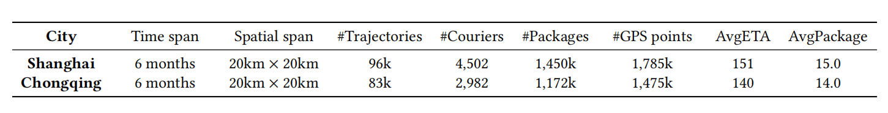
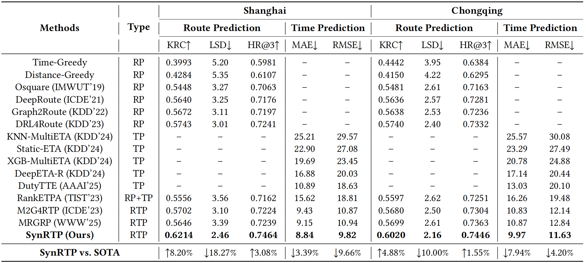

# SynRTP

The architecture of SynRTP, as shown in Figure 1, comprises three key components: 1) A **spatiotemporal graph encoder** that captures both spatial dependencies among tasks and their temporal evolution. 2) A **synergistic route-time decoder** where the route policy and time predictor are jointly optimized through gradient cooperation (addressing gradient isolation). 3) A **RL-enhanced training strategy** combining GDRPO for enhanced route exploration with uncertainty-based multi-task balancing. test


<p align="center"><b>Figure&nbsp;1</b> Architecture of SynRTP.</p>


## 1. Experimental Details

### 1.1 Experimental Setting


SynRTP is implemented in PyTorch and trained on a Tesla V100 (16 GB) GPU. After extensive hyperparameter tuning(details are provided in Sec 4.4 of the paper.), we select a hidden dimension $d_h=32$, a 3‑layer Graphormer encoder with 4 attention heads per layer, and a GDRPO group sampling size $G=16$. Policy updates use the Adam optimizer with a learning rate of $1\times10^{-4}$ and a PPO‑style clipping parameter $\epsilon=0.2$. Training adopts a two‑stage scheme: 4 epochs of supervised pre‑training followed by fine‑tuning with a batch size of 64. A cosine annealing scheduler controls the learning rate, and early stopping is applied with a patience of 11 epochs based on the validation KRC metric.


### 1.2 Dataset Description

We evaluate our approach using two large-scale real-world last-mile delivery datasets from LaDe[^1], collected by Cainiao Network, one of China's largest logistics platforms. The datasets comprise delivery records from ***Shanghai*** and ***Chongqing***, representing diverse urban environments. The **Table 1** summarizes key statistics. Each dataset spans six months and covers approximately 400 km<sup>2</sup>, with couriers serving as workers and delivery tasks as nodes in our formulation.

[^1]: https://huggingface.co/datasets/Cainiao-AI/LaDe

<p align="center"><b>Table&nbsp;1</b> Dataset statistics.</p>
Statistics of the two subsets from LaDe used in our experiments. AvgETA stands for the average arrival time per package. AvgPackage means the average package number of a courier per day. The unit of AvgETA is minutes.  




The original datasets can be downloaded from the following link: https://huggingface.co/datasets/Cainiao-AI/LaDe. 

Install environment dependencies using the following command:

```shell
pip install -r requirements.txt
```

After downloading the original datasets, please use the following command to generate the data required for model training:
```shell
python data_processing.py
```

To facilitate verification of the correctness of the model code, we provide a very small dataset, extracting a batch size of 8 from each of the original data training set, validation set and test set (the default batch size of the model dataset is 64). The data structure should be like:
/data/dataset/

├── cq_dataset    
│   ├── train_small.npy   
│   └── ...    
└── sh_dataset  
    ├── train_small.npy  
    └── ...  


### 1.3 Training SynRTP Model


Run the following command to train the SynRTP:

```shell
python run.py
```


### 1.4 Experimental Results

<p align="center">
<b>Table&nbsp;2</b> Performance comparison on route and time prediction. The upward arrow (↑) indicates that a higher value is better for metrics; the downward arrow (↓) indicates that a lower value is better for metrics. '--' means not available.
</p>

<p align="center"><b>Table&nbsp;2</b> Performance comparisons.</p>




### 1.5 Baseline Reproduction

The baseline reproduction method can be obtained through the following link：
https://github.com/wenhaomin/LaDe/tree/master


