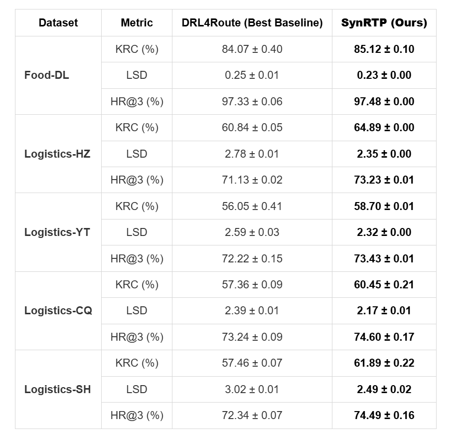

# SynRTP

The architecture of SynRTP, as shown in Figure 1, comprises three key components: 1) A **spatiotemporal graph encoder** that captures both spatial dependencies among tasks and their temporal evolution. 2) A **synergistic route-time decoder** where the route policy and time predictor are jointly optimized through gradient cooperation (addressing gradient isolation). 3) A **RL-enhanced training strategy** combining GDRPO for enhanced route exploration with uncertainty-based multi-task balancing. test


<p align="center"><b>Figure&nbsp;1</b> Architecture of SynRTP.</p>


## 1. Supplementary Experiment

---

### 1.1 Model Generalization on New Dataset

To demonstrate the robust generalization capability of our proposed framework beyond the original experimental settings, we extended our evaluation to include three additional large-scale real-world datasets. These datasets were strategically selected to introduce significant diversity in terms of service platforms, business scenarios, and geographic environments:

Food-DL (Cross-Platform & Cross-Scenario): Sourced from Ele.me, a leading on-demand food delivery platform. Unlike the original logistics datasets (LaDe/Cainiao), this dataset represents a distinct Food Delivery scenario with different time sensitivities and routing constraints, verifying the model's effectiveness across different platforms and business modes.

Logistics-HZ & Logistics-YT (Geographic Generalization): Sourced from two additional major cities (Hangzhou and Yantai). These datasets validate the model's adaptability to varying urban layouts and road networks.

As shown in Table R1, SynRTP consistently outperforms state-of-the-art baselines across all three new datasets. Notably, in the cross-domain Food-DL scenario, our model achieves a substantial performance gain, reducing the MAE of time prediction by 23.32% compared to the best baseline while maintaining superior route prediction accuracy. These results confirm that SynRTP generalizes well to diverse delivery environments and is not limited to specific platforms or city patterns.

<p align="center">   <b>Table 1</b> Performance comparisons on three additional datasets (Food-DL, Logistics-HZ, and Logistics-YT). </p>


### 1.2 Computational Efficiency and Scalability Analysis

To address concerns regarding the computational complexity and deployment feasibility of our framework, we conducted a comprehensive efficiency analysis across all five datasets. We focus on two key aspects: inference efficiency (crucial for real-time online deployment) and training scalability (specifically regarding the sampling size $G$).

<b>(1) Inference Efficiency and Resource Usage</b>

As shown in Table R2, we compared SynRTP with representative baselines. Lightweight Architecture: SynRTP exhibits remarkable model compactness with only 0.2M parameters, significantly fewer than other joint RTP models (e.g., MRGRP requires 5.7M). Fast Inference Speed: Crucially for real-time logistics systems, our model achieves SOTA-level inference efficiency (e.g., 10.6s for the entire test set on Food-DL), which is comparable to simple greedy heuristics and significantly faster than complex deep learning baselines like Graph2Route or MRGRP. Low Memory Footprint: During the inference phase, the GPU memory consumption is minimal (0.10 GB), making the model highly suitable for deployment on resource-constrained edge devices or high-concurrency cloud environments. It is important to note that while the reinforcement learning process (GDRPO) increases training time, this is strictly an offline cost that does not impact online service latency.

<p align="center"> <b>Table 2</b> Efficiency comparison across different datasets. </p>


<b> (2) Scalability of Sampling Size $G$ </b>

We further investigated the computational overhead introduced by the group sampling mechanism during the GDRPO phase. Figure R1 illustrates the relationship between training time per epoch and the sampling size $G$. The results demonstrate a Linear Scalability, where training time increases linearly rather than exponentially with $G$, indicating that the computational cost is predictable and controllable. Based on this analysis, we selected $G=16$ as the default setting to achieve an optimal balance between exploration sufficiency and training efficiency. Even with this setting, the training overhead remains within a manageable range, while the inference stage remains completely unaffected by the value of $G$.


<p align="center"><b>Figure 1</b> Computational overhead analysis with varying sampling numbers <i>G</i> </p>


### 1.3 Theoretical Analysis: The Relationship between GDRPO, PPO, and GRPO


### 1.4 Statistics on Datasets

To ensure a comprehensive evaluation, we expanded our experimental scope to include five large-scale real-world datasets, which cover a wide spectrum of delivery scenarios, ranging from standard package logistics to high-urgency food delivery.

<b>(1) Logistics Datasets: Geographic & Topological Robustness</b>

We employ four datasets (Logistics-SH, CQ, HZ, YT) from the Cainiao Network to test the model's stability across diverse urban environments.<b>Topological Diversity:</b> The datasets span from the dense, flat urban grids of Shanghai and Hangzhou (mega-metropolises) to the complex, mountainous terrain of Chongqing (often called the "Mountain City" with non-Euclidean road networks) and the coastal layout of Yantai.<b>Scale Variation: </b>Coverage ranges from heavy logistics hubs to smaller regional networks. This variety challenges the graph encoder to adapt to distinct road network structures and varying traffic densities without overfitting to a single city's layout.


<b>(2) Food Delivery Dataset: Cross-Platform & Cross-Domain Generalization</b>

The Food-DL dataset, sourced from Ele.me, represents a fundamental shift in operational logic compared to logistics, serving as a critical test for cross-domain generalization.<b>Cross-Platform Distribution:</b>Originating from a different service provider (Ele.me vs. Cainiao), this dataset inherently contains different data recording standards and courier behavioral patterns, validating that SynRTP is not biased toward specific platform engineering.<b>Operational Paradigm Shift:</b> As shown in Table 3, Food-DL exhibits a drastically shorter AvgETA (27 min vs. 150 min) and lower AvgPackage density (4.0 vs. 15.0). This reflects the "instant" nature of food delivery, which prioritizes immediate responsiveness and strict time windows over the batch efficiency typical of logistics.


By succeeding on both the high-latency, high-density logistics tasks and the low-latency, high-frequency food delivery tasks, SynRTP demonstrates a robust ability to generalize across varying business logics and operational constraints.The dataset statistics are summarized in **Table 3**.

<p align="center"> <b>Table 3</b> Summary statistics of the datasets. AvgETA (in minutes) stands for the average arrival time per package. AvgPackage means the average package number of a courier per day. </p>


## 2. Experimental Details

### 2.1 Implementation Details & Fairness Protocol

To ensure reproducibility and rigorous fair comparison, all experiments were conducted on a uniform hardware platform equipped with a single Tesla V100 (16 GB) GPU. We implemented SynRTP using PyTorch. For all baseline models, we adopted a standardized evaluation protocol to eliminate implementation bias:

<b>(1) Standardized Benchmark Configurations</b>

<b> LaDe Benchmark Baselines: </b> Most baselines (including DeepRoute, Graph2Route, L2R, etc.) and the datasets used in this paper are sourced from the open-source LaDe Benchmark repository. To ensure our results are directly comparable with community standards, we strictly utilized the official implementations and default optimal hyperparameter configurations provided by the LaDe repository. <b>Independent Baselines: </b>For baselines not included in LaDe (i.e., DutyTTE and MRGRP), we strictly adhered to the same principle: utilizing their respective official open-source codes and adopting the default optimal hyperparameter combinations recommended by the original authors. This strategy ensures that every baseline is evaluated at its intended peak performance capability, avoiding any potential bias from subjective hyperparameter tuning.

<b>(2) Strict Fairness Control </b> 

Beyond model configurations, we enforced a unified training protocol across all methods to ensure no model received an unfair advantage: <b> Input Consistency.</b>  All models utilize the exact same set of input features (spatial coordinates, temporal timestamps, and courier profiles). We ensured that no baseline was handicapped by missing features, nor did any model benefit from extra information unavailable to others. <b> Termination Criterion.</b> To prevent over-training or under-training biases, we applied a consistent Early Stopping mechanism across all models. Training terminates if the validation metric (KRC) does not improve for a patience of 11 epochs.

<b>(3) SynRTP Settings:</b> 

For our proposed SynRTP, we selected hyperparameters based on validation set performance: a hidden dimension $d_h=32$, a 3-layer Graphormer encoder with 4 attention heads, and a GDRPO group sampling size $G=16$. The model is trained using a two-stage scheme with the Adam optimizer ($lr=1\times10^{-4}$).


### 2.2 Dataset Description

We evaluate our approach using five large-scale real-world datasets to ensure robust generalization. Beyond the original logistics datasets from Shanghai and Chongqing (collected by Cainiao Network)LaDe[^1], we incorporate two additional logistics datasets from Hangzhou and Yantai, as well as a cross-domain food delivery dataset from Dalian (collected by Ele.me[^2]). Collectively, these datasets span diverse urban environments (from mountainous terrains to coastal cities) and distinct operational modes (standard logistics vs. on-demand food delivery), providing a comprehensive benchmark for performance evaluation.

[^1]: https://huggingface.co/datasets/Cainiao-AI/LaDe

[^2]: https://tianchi.aliyun.com/competition/entrance/231777/information


The original datasets can be downloaded from the following link: https://huggingface.co/datasets/Cainiao-AI/LaDe. and https://tianchi.aliyun.com/competition/entrance/231777/information.

Install environment dependencies using the following command:

```shell
pip install -r requirements.txt
```

### 2.3 Data Generation for Model Training

After downloading the original datasets, please use the following command to generate the data required for model training:
```shell
python data_processing.py
```

To facilitate verification of the correctness of the model code, we provide a very small dataset, extracting a batch size of 8 from each of the original data training set, validation set and test set (the default batch size of the model dataset is 64). The data structure should be like:
/data/dataset/

├── cq_dataset    
│   ├── train_small.npy   
│   └── ...    
└── sh_dataset  
    ├── train_small.npy  
    └── ...  


### 2.4 Training SynRTP Model


Run the following command to train the SynRTP:

```shell
python run.py
```


### 2.5 Experimental Results

**Table 4** presents the comprehensive performance comparison of SynRTP against state-of-the-art baselines across all five datasets. Our model consistently achieves superior performance in both route prediction (KRC, LSD, HR@3) and time prediction (MAE, RMSE) tasks, demonstrating its robustness across diverse platforms and geographic environments.

To address concerns regarding model stability and experimental variance, we conducted three independent runs for SynRTP to report the mean and standard deviation ($\text{mean} \pm \text{std}$). Due to the limited time window during the rebuttal phase, we were unable to re-train all baselines three times. However, as shown in **Table 5**, SynRTP exhibits low variance across independent runs, demonstrating the inherent stability of our proposed framework. We are fully committed to extending this multi-run statistical analysis to all remaining baselines in the final camera-ready version to further ensure the reproducibility and rigorous comparison of our results.


<p align="center"> <b>Table 4</b> Performance comparison on route and time prediction across five datasets. </p>


<p align="center"><b>Table 5</b> Stability analysis: Comparison of Mean ± Std between SynRTP over 3 independent runs.</p>




### 2.6 Baseline Reproduction

Use the following commands to reproduce baseline models:
```shell


```


